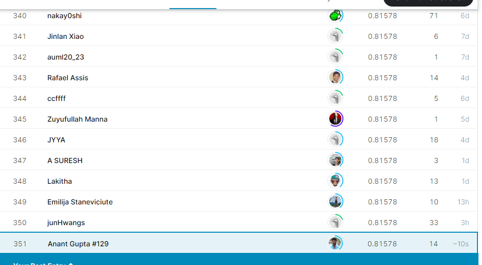

# Kaggle-m-Titanic-Machine-Learning-from-Disaster-top-2-

The Titanic challenge on Kaggle is a competition in which the task is to predict the survival or the death of a given passenger based on a set of variables describing him such as his age, his sex, or his passenger class on the boat.
As I'm writing this post, I am ranked among the top 2% of all Kagglers: More than 17,974 teams are currently competing.

Goal for this Notebook:
-----------
Show a simple example of an analysis of the Titanic disaster in Python using a full complement of PyData utilities. This is aimed for those looking to get into the field or those who are already in the field and looking to see an example of an analysis done with Python.

Model Pipe line:
------
* 1. Importing Libraries
* 2. Importing Dataset
    * 2.1 Overview
* 3. Feature Engineering
    * 3.1 Heatmap
    * 3.2 Age Histogram Plot
    * 3.3 Missing Values
* 4. Creating train and test set and label encoding
* 5. XGBoost Model

